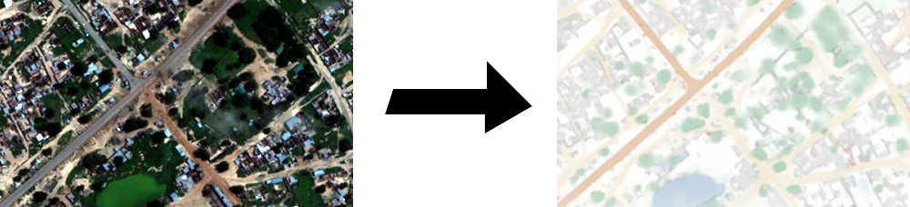
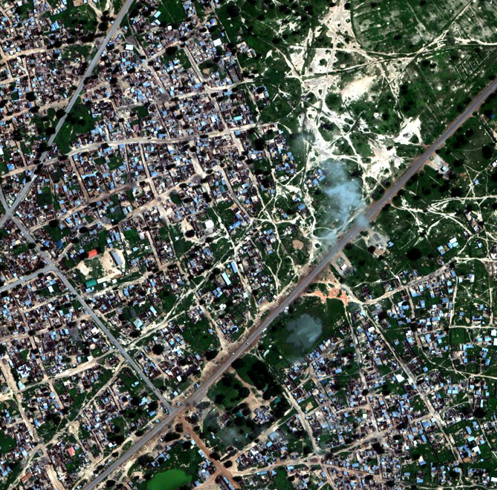
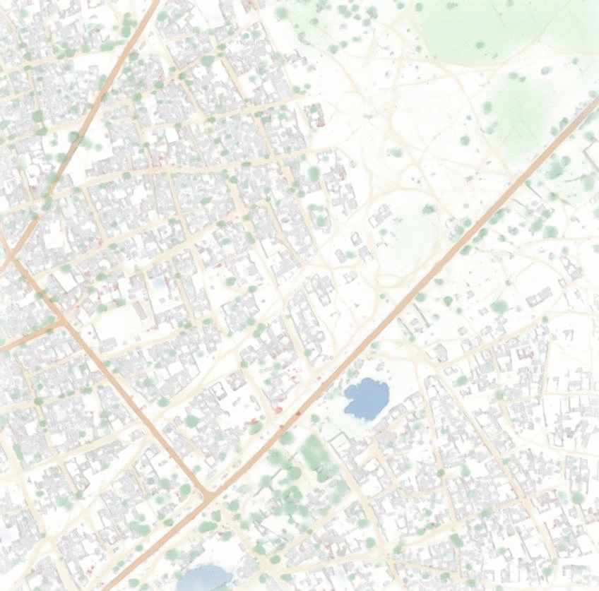
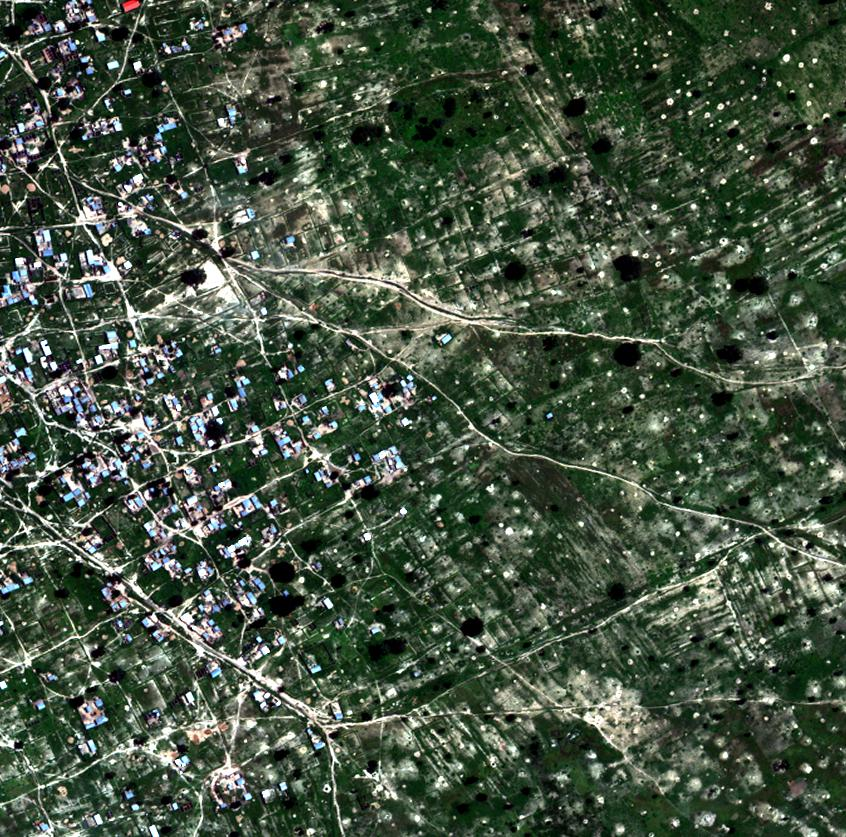
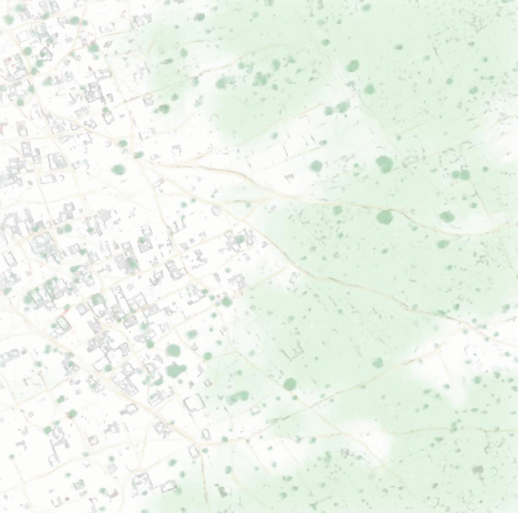
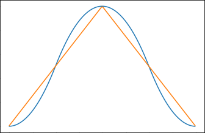
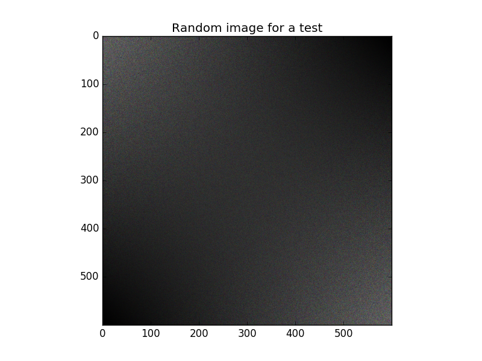
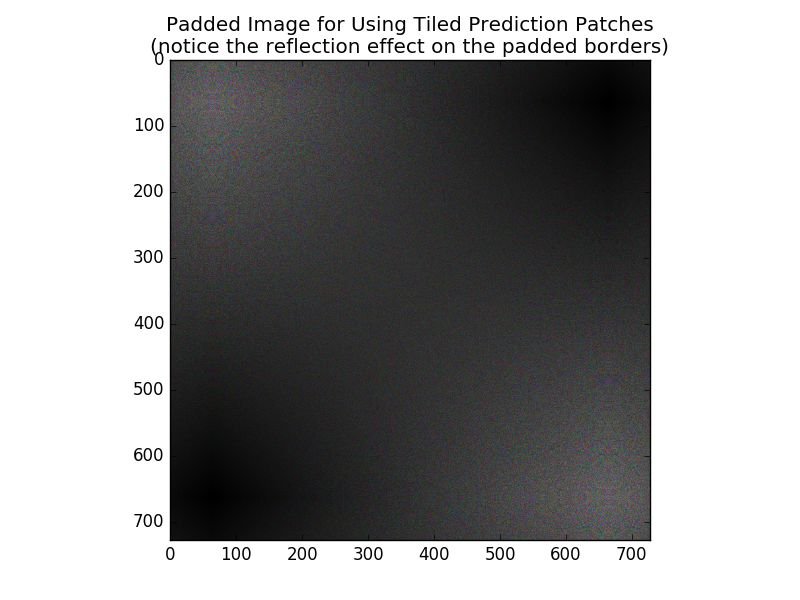
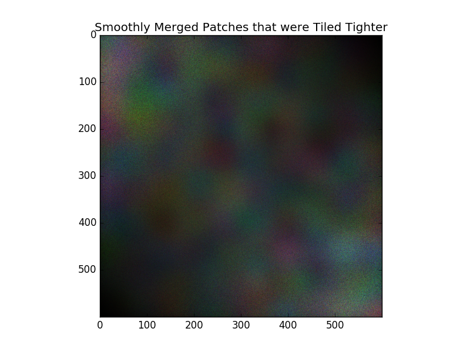
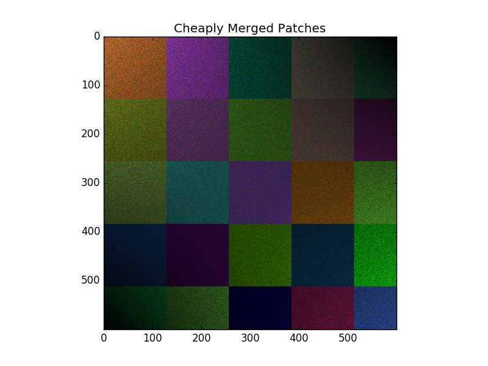

# Make smooth predictions by blending image patches, such as for image segmentation

One challenge of using a U-Net for image segmentation is to have smooth predictions, especially if the receptive field of the neural network is a small amount of pixels.

[](https://vooban.com/en/tips-articles-geek-stuff/satellite-image-segmentation-workflow-with-u-net/)

For example, here is what the code in this repository can achieve, to make smooth predictions rather than jagged ones. For more information on the neural network architecture, check out this blog post on [satellite image segmentation](https://vooban.com/en/tips-articles-geek-stuff/satellite-image-segmentation-workflow-with-u-net/).

## Example of predictions with and without this algorithm
### Example 1
Input image:
[](https://www.kaggle.com/c/dstl-satellite-imagery-feature-detection)
Output with v.s. without our algorithm, our predictions are smooth and with reduced variance:


### Example 2
Input image:
[](https://www.kaggle.com/c/dstl-satellite-imagery-feature-detection)
Output with v.s. without our algorithm, our predictions are smooth and with reduced variance:


## Motivation

In fact, the U-Net take image patches and make predictions on those small local windows, without data near the border of the patches, so there might first be a high error on the predictions made near the outside of the window, in plus of the fact that predictions may be just concatenated, so it looks even more jagged.

One solution would be to vary the size of the inputs and outputs at train time and to use one large CNN at test time, but that would be challenging to achieve, especially with libraries like TensorFlow and Keras where the CNN's computational graph is compiled statically. A simpler way to solve that problem is through using 2D interpolation between overlapping patches when doing the final predictions. This is what the current algorithm does. The algorithm takes as an input the image and its size, the size of the windows, the number of times we want to overlap and finally it also accepts as a lambda the function that performs local predictions.

The way I coded that is that it splits the image into patches, using a 5D NumPy array. Image patches are already a 3D array, and ordering them in space can require 2 extra dimensions. Those patches are then reshaped to 4D with along a single `batch_size` dimensions to be passed into the neural network’s prediction function, which can take advantage of doing batch predictions since patches are all loaded in memory rather than individually iterated upon, assuming enough memory is available (I had 32 GB RAM on a GPU server, but did not used all the RAM). The predictions are then put together back into the 5D array to be merged with a spline interpolation to a regular 3D image array.

Again, this method is fast because it takes advantage of the batch_size for a GPU usage in the neural network. However, this method is unsuitable for regular computers if the image is too big, since the 5D array can be huge to fit in the CPU’s RAM (the GPU RAM usage is balanced through the usage of a batch_size variable within the passed prediction function).

## Implementation details

One would like to have smoothly merged prediction on its image patches rather than concatenating square ones without any interpolation.

### Rotations and mirroring

First, we use rotations and mirrors in the algorithm, so as to make the neural network view the image under several different angles. This is then averaged out and thus reduces variance in the predictions. Specifically, we use the [Dihedral Group D_4](http://mathworld.wolfram.com/DihedralGroupD4.html). In other words, we use the 4 possible 90 degrees rotations, as well as a mirrored version of those rotations, so as to augment the image(s) 8-fold for prediction before blending the predictions together.

### Windowing for smooth predictions

For blending the predictions together, we use interpolation with a simple second order spline [window function](https://en.wikipedia.org/wiki/Window_function): weighting pixels when merging patches together. The amount of overlap between merged windows can be changed in the code for up to perfectly windowed predictions (the default is 50% overlap rather than near-complete overlap). Here is how our window looks like compared to a basic triangle window:



This window function is expanded to two dimensions (because images are 2D) so as to look like this, the color intensity here is relative to height of the window:


The windowing uses a "same" padding strategy rather than a "valid" padding strategy, to predict images with the same size as the input was.

### Input image padding

Because the windowing can take samples outside of the input images for the reconstruction of predictions, the input image is first enlarged (with mirror-padding) to then do predictions and unpad the resulting image.

For example, here is a random image considered as an input to the algorithm:



It is mirror-padded on its borders:



Then predictions are made, merged, and the result is un-padded to remove the extra-borders predicted. Notice that we used a prediction function to mock a neural network (e.g.: U-Net), but that our mocking function just applies a random change in color and lightness for different patches:



For example, here is what the predictions would look like using the same prediction function, but by not using our algorithm and rather just a concatenation of the patches:



You can run the python file containing our algorithm by yourself as a main rather than importing it. When run as a main, it perform tests reproducing some of the images above, and it also checks if the error in reconstruction is low.

### Reconstruction error

To check the reconstruction error, we run our algorithm on the above random test images, but by passing in a prediction function that does nothing and returns the input as if it was the output. The amount of mean absolute error is of approximately 0.28 %.

You can run the file as a main to run tests, such as:
```
$ python3 smooth_tiled_predictions.py
```

## How to use this algorithm in your code

Download [this file](https://github.com/Vooban/Smoothly-Blend-Image-Patches/blob/master/smooth_tiled_predictions.py) which is to be imported in Python 3. You may also want to install [requirements](https://github.com/Vooban/Smoothly-Blend-Image-Patches/blob/master/requirements.txt).

```python
from smooth_tiled_predictions import predict_img_with_smooth_windowing

from your_code import your_model

# Instanciate a U-Net CNN (or any similarly-behaved neural network) in the variable named `model`. We use a Keras model but it can be anything:
model = your_model()

# CNN's receptive field's border size: size of patches
window_size = 160

# Amount of categories predicted per pixels.
nb_classes = 10

# Load an image. Convention is channel_last, such as having an input_img.shape of: (x, y, nb_channels), where nb_channels is of 3 for regular RGB images.
input_img = ...

# Use the algorithm. The `pred_func` is passed and will process all the image 8-fold by tiling small patches with overlap, called once with all those image as a batch outer dimension.
# Note that model.predict(...) accepts a 4D tensor of shape (batch, x, y, nb_channels), such as a Keras model.
predictions_smooth = predict_img_with_smooth_windowing(
    input_img,
    window_size=window_size,
    subdivisions=2,  # Minimal amount of overlap for windowing. Must be an even number.
    nb_classes=nb_classes,
    pred_func=(
        lambda img_batch_subdiv: model.predict(img_batch_subdiv)
    )
)

# For more details, refer to comments and code in smooth_tiled_predictions.py
```

Coded by [Guillaume Chevalier](https://github.com/guillaume-chevalier) at [Vooban](https://vooban.com/en/).

[MIT License](https://github.com/Vooban/Smoothly-Blend-Image-Patches/blob/master/LICENSE). Copyright (c) 2017 Vooban Inc.

## For more information

Visit the company's website to learn more about [image segmentation with deep neural networks](https://vooban.com/en/tips-articles-geek-stuff/satellite-image-segmentation-workflow-with-u-net/).
